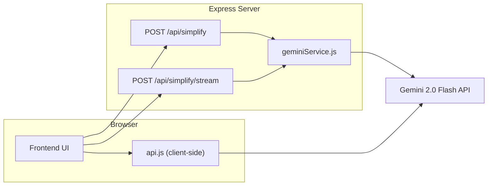

# Medical Letter Simplifier — P2 API & File-Handling Layer

> **Status:** ✅ Complete & syntax-validated
> **Date:** May 26, 2025

---

## Overview

This document covers all backend changes for **P2: API calls, file handling, and streaming**. Three files were touched — two modified, one created.

| File | Action | Purpose |
|------|--------|---------|
| [geminiService.js](file:///Users/karennguyen/Luma-CTC-hack/geminiService.js) | Modified | Added `simplifyMedicalLetterStream()` async generator |
| [server.js](file:///Users/karennguyen/Luma-CTC-hack/server.js) | Modified | Added `POST /api/simplify/stream` SSE route + health check flag |
| [api.js](file:///Users/karennguyen/Luma-CTC-hack/api.js) | **New** | Client-side API layer (direct Gemini REST calls, file handling, drag-and-drop) |

---

## Architecture



> [!NOTE]
> **Two paths to Gemini exist by design:**
> - `api.js` calls Gemini **directly from the browser** (good for hackathon speed — no round-trip through Express).
> - `server.js` routes call Gemini **through Express** (better for production — keeps the API key server-side).
>
> Your frontend can use **either** path. Pick one and stick with it.

---

## 1. `geminiService.js` — What Changed

### Existing (untouched)
- `prepareFileBlock(file)` — validates & base64-encodes a Multer file object
- `simplifyMedicalLetter({ text, file })` — non-streaming call, returns `{ success, simplifiedText, emptyInput }`

### Added: `simplifyMedicalLetterStream({ text, file })`

```js
import { simplifyMedicalLetterStream } from './geminiService.js';
```

- **Type:** `async function*` (async generator)
- **Params:** Same as `simplifyMedicalLetter` — `{ text?: string, file?: MulterFile }`
- **Yields:** `string` chunks as they arrive from `ai.models.generateContentStream()`
- **Throws:** `Error` with a descriptive message on:
  - Missing `GEMINI_API_KEY`
  - Empty input (no text and no valid file)
  - Any Gemini API error

**Usage from a route:**
```js
const stream = simplifyMedicalLetterStream({ text, file });
for await (const chunk of stream) {
  res.write(`data: ${chunk}\n\n`);
}
```

---

## 2. `server.js` — What Changed

### Existing (untouched)
- `GET /health` — health check
- `GET /` — root info
- `POST /api/simplify` — non-streaming simplification

### Modified: `GET /health`

Added `streamingSupported: true` to the response JSON.

```json
{
  "status": "healthy",
  "timestamp": "...",
  "geminiConfigured": true,
  "maxFileSizeLimit": 20971520,
  "streamingSupported": true
}
```

### Added: `POST /api/simplify/stream`

**SSE (Server-Sent Events) endpoint for real-time streaming.**

#### Request
Same as `/api/simplify` — multipart form with:
- `text` (string, optional) — pasted medical letter
- `file` (file, optional) — PDF/image upload (field name: `file`)

#### Response Headers
```
Content-Type: text/event-stream
Cache-Control: no-cache
Connection: keep-alive
```

#### Response Body (SSE stream)
```
data: Here is the first chunk of text...

data: ...and the next chunk...

data: [DONE]

```

On error:
```
data: [ERROR] GEMINI_API_KEY environment variable is not defined.

```

#### Client Disconnect
The route listens for `req.on('close')` and stops iterating the generator early, so no work is wasted if the user navigates away.

---

## 3. `api.js` — New Client-Side Module

> [!IMPORTANT]
> This file calls Gemini **directly from the browser**. The API key must be available client-side (via `window.__ENV.GEMINI_API_KEY`, `import.meta.env.VITE_GEMINI_API_KEY`, or `process.env.GEMINI_API_KEY`).

### Exports

| Function | Signature | Returns |
|----------|-----------|---------|
| `callGemini` | `(text: string)` | `Promise<Object>` — parsed JSON |
| `callGeminiWithFile` | `(base64: string, mimeType: string)` | `Promise<Object>` — parsed JSON |
| `callGeminiStreaming` | `(text: string, onChunk: Function)` | `Promise<string>` — full text |
| `handleFileUpload` | `(file: File)` | `Promise<{base64, mimeType, fileName}>` |
| `setupDropZone` | `(el: HTMLElement, onFile: Function, onError: Function)` | `void` |

### Expected JSON Response Shape

All non-streaming calls (`callGemini`, `callGeminiWithFile`) return this shape after parsing:

```json
{
  "urgency_level": "urgent | caution | clear",
  "red_flags": ["string"],
  "summary": "string",
  "action_plan": [
    {
      "timing": "now | this week | this month | ongoing",
      "action": "string",
      "reason": "string"
    }
  ],
  "questions": ["string"]
}
```

This is enforced via the system prompt — the model is told to return **only** this JSON, no markdown fences.

### Error Handling

All errors throw `ApiError` with a `.code` property:

| Code | Trigger |
|------|---------|
| `EMPTY_INPUT` | No text or file provided |
| `MISSING_API_KEY` | API key not found in any env source |
| `FILE_TOO_LARGE` | File exceeds 20 MB |
| `UNSUPPORTED_FILE_TYPE` | Not PDF/JPEG/PNG/WebP |
| `FILE_READ_ERROR` | FileReader failed |
| `PERMISSION_DENIED` | Invalid Gemini API key (HTTP 403) |
| `RESOURCE_EXHAUSTED` | Quota exceeded (HTTP 429) |
| `JSON_PARSE_ERROR` | Model returned unparseable response |
| `INVALID_RESPONSE_SHAPE` | JSON missing required fields |
| `EMPTY_RESPONSE` | Model returned nothing |

### Drop Zone Setup

```js
import { setupDropZone, callGeminiWithFile } from './api.js';

const dropZone = document.getElementById('drop-zone');

setupDropZone(
  dropZone,
  async ({ base64, mimeType, fileName }) => {
    console.log(`File ready: ${fileName}`);
    const result = await callGeminiWithFile(base64, mimeType);
    renderResult(result);
  },
  (err) => {
    showError(err.message); // user-friendly message
  }
);
```

Supports both **drag-and-drop** and **click-to-upload**. A CSS class `drop-zone--active` is toggled during drag-over for visual feedback.

---

## Frontend Integration Quick Reference

### Option A: Use Express backend (recommended — keeps API key server-side)

```js
// Non-streaming
const form = new FormData();
form.append('text', medicalLetterText);
// form.append('file', fileInput.files[0]); // optional
const res = await fetch('/api/simplify', { method: 'POST', body: form });
const data = await res.json();
// data.simplifiedText contains the response

// Streaming
const form = new FormData();
form.append('text', medicalLetterText);
const res = await fetch('/api/simplify/stream', { method: 'POST', body: form });
const reader = res.body.getReader();
const decoder = new TextDecoder();
while (true) {
  const { done, value } = await reader.read();
  if (done) break;
  const text = decoder.decode(value);
  // Parse SSE lines: each starts with "data: "
  // Check for "data: [DONE]" or "data: [ERROR] ..."
}
```

### Option B: Use `api.js` directly (faster for hackathon — no Express needed)

```js
import { callGemini, callGeminiStreaming, setupDropZone } from './api.js';

// Text only
const result = await callGemini(letterText);

// Streaming
await callGeminiStreaming(letterText, (chunk) => {
  outputDiv.textContent += chunk;
});
```

---

## Environment Variables

| Variable | Required | Default | Notes |
|----------|----------|---------|-------|
| `GEMINI_API_KEY` | ✅ | — | Your Google Gemini API key |
| `PORT` | No | `5000` | Express server port |
| `GEMINI_MODEL` | No | `gemini-2.5-flash` | Model name for server-side calls |
| `MAX_FILE_SIZE` | No | `20971520` (20 MB) | Max upload size in bytes |
| `FRONTEND_URL` | No | `*` | CORS allowed origin |

---

## Running

```bash
npm install
cp .env.template .env
# Add your GEMINI_API_KEY to .env
npm run dev    # starts with nodemon
```

Health check: `GET http://localhost:5000/health`
