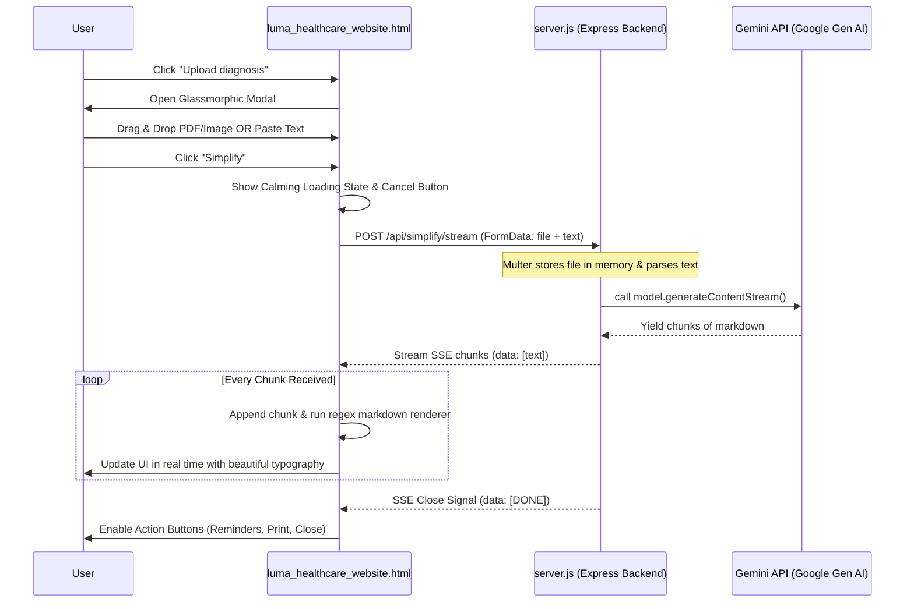

# Medical Letter Simplifier — P4 Frontend Integration Layer

> **Status:** ⚙️ In Progress / Wiring
> **Date:** May 26, 2026

---

## Overview

This document describes the design, implementation, and API integration details of the frontend for **Luma**. The frontend is fully client-side (vanilla HTML, CSS, and JS) and connects to the Express-Multer backend to perform medical jargon translation with SSE streaming support.

| File | Action | Purpose |
|------|--------|---------|
| [luma_healthcare_website.html](file:///c:/Users/alexs/OneDrive/Documents/GitHub/Luma-CTC-hack/luma_healthcare_website.html) | Modified | Added glassmorphic simplifier modal, drag-and-drop dropzone, text input, SSE stream decoder, client-side Markdown rendering, and abort mechanics. |
| [4frontend.md](file:///c:/Users/alexs/OneDrive/Documents/GitHub/Luma-CTC-hack/md_files/4frontend.md) | **New** | Frontend documentation (this file). |

---

## Architecture & Integration Flow

The frontend coordinates user input (file upload/paste) and handles the streaming response directly:



---

## 1. UI Elements Added

### Glassmorphic Simplifier Modal
A full-screen background overlay (`backdrop-filter: blur(12px)`) that slides in from the bottom. Built using the design system of Luma:
*   **Theme Integration**: Inherits the dark-navy gradients (`--navy`, `--indigo`, `--indigo2`) with glowing cyan active boundaries (`--cyan`, `--cyan2`).
*   **Interactive File Drop Zone**: A dashed border element that lights up cyan when files are hovered over (`.drop-zone--active`).
*   **Pasted Text Input**: A textarea styled to fade into the background, supporting simple copy-pasted medical letters.
*   **Calming Emotionally-Intelligent Loading Card**: Replaces the form during API calls with a slow-breathing pulse and comforting prompts ("Translating clinical jargon to comforting clarity...", "Taking a deep breath...").

---

## 2. Server-Sent Events (SSE) Client Implementation

Since the backend handles file parsing via `multer` inside multipart forms, the browser uploads the files using `fetch` with a `FormData` object instead of raw JSON. We read the response body as a stream:

```javascript
const formData = new FormData();
if (selectedFile) {
  formData.append('file', selectedFile);
}
if (pastedText) {
  formData.append('text', pastedText);
}

const controller = new AbortController();
const response = await fetch('http://localhost:5000/api/simplify/stream', {
  method: 'POST',
  body: formData,
  signal: controller.signal
});

const reader = response.body.getReader();
const decoder = new TextDecoder();
let buffer = '';

while (true) {
  const { done, value } = await reader.read();
  if (done) break;

  buffer += decoder.decode(value, { stream: true });
  const lines = buffer.split('\n');
  buffer = lines.pop(); // Keep partial line in buffer

  for (const line of lines) {
    if (line.startsWith('data: ')) {
      const data = line.slice(6).trim();
      if (data === '[DONE]') {
        // Stream completed successfully
        finishStream();
      } else if (data.startsWith('[ERROR]')) {
        // Display backend error
        showError(data.replace('[ERROR]', ''));
      } else {
        // Append streamed text and render
        streamedText += data;
        renderMarkdown(streamedText);
      }
    }
  }
}
```

---

## 3. Lightweight Client-Side Markdown Parser

To keep the page lightweight and standalone, we parse Gemini's markdown output using regex replacements inside the script block:

```javascript
function formatMarkdown(text) {
  let html = text;

  // Escape HTML entities to prevent XSS
  html = html
    .replace(/&/g, '&amp;')
    .replace(/</g, '&lt;')
    .replace(/>/g, '&gt;');

  // Translate Headings
  html = html.replace(/^#\s+(.+)$/gm, '<h2 class="stream-h2">$1</h2>');
  html = html.replace(/^##\s+(.+)$/gm, '<h3 class="stream-h3">$1</h3>');

  // Translate Bold Text
  html = html.replace(/\*\*(.*?)\*\*/g, '<strong>$1</strong>');

  // Translate Bullet Lists
  html = html.replace(/^\s*-\s+(.+)$/gm, '<li class="stream-li">$1</li>');

  // Wrap list items in list tags (if consecutive)
  html = html.replace(/(<li class="stream-li">.*<\/li>)/gs, '<ul class="stream-ul">$1</ul>');

  // Translate Paragraphs (double newlines)
  html = html.replace(/\n\n/g, '</p><p>');
  html = '<p>' + html.replace(/\n/g, '<br>') + '</p>';

  // Clean up empty tags
  html = html.replace(/<p><\/p>/g, '');

  return html;
}
```

---

## 4. Error Handling Mechanics

The frontend intercepts potential issue states:
1.  **File Validation**: Rejects files over 20MB or files that are not images/PDFs before uploading.
2.  **Streaming Abort**: Clicking "Cancel" or closing the modal invokes `controller.abort()`, shutting down the HTTP stream and saving network bandwidth.
3.  **Graceful API Fallback**: If the API fails or returns `emptyInput: true`, Luma displays a warm recovery card allowing the user to retry or paste their letter manually.
